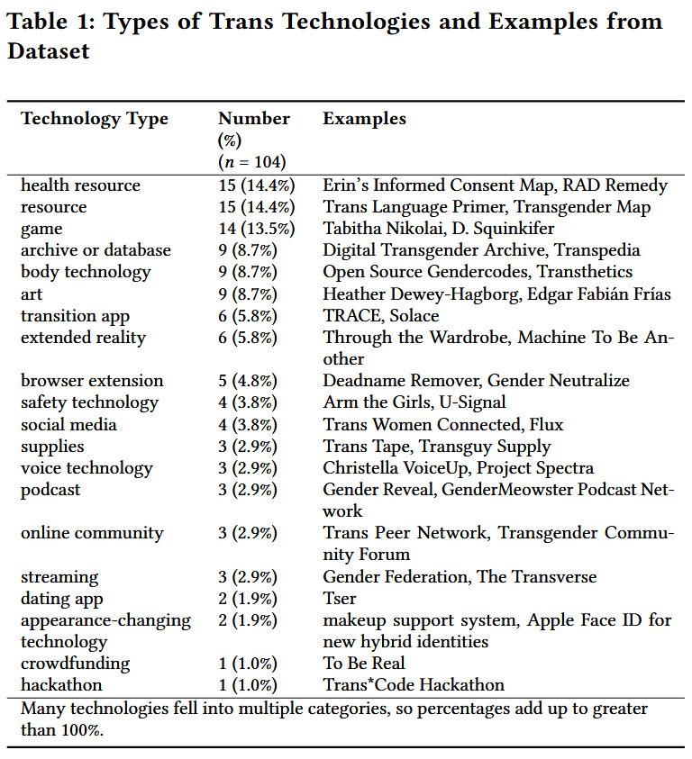
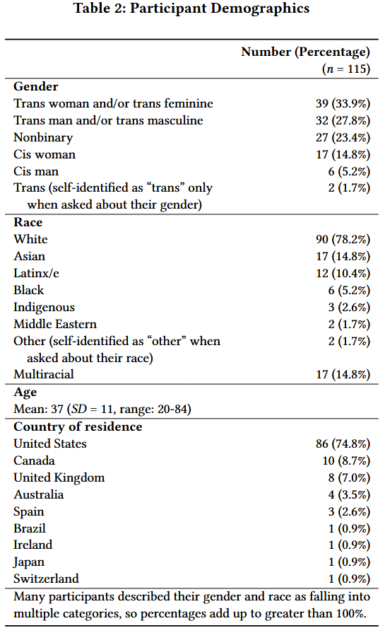

# 跨性别者及社群如何参与跨性别技术设计过程

DOI：doi.org/10.1145/3544548.3580972

Author：Oliver L. Haimson, Kai Nham, Hibby Thach, Aloe DeGuia

Journal：In Proceedings of the 2023 CHI Conference on Human Factorsin Computing Systems (CHI ’23)

## 摘要

跨性别技术（Trans technology）——为帮助解决跨性别者面临的挑战而创建的技术，是一个重要的创新领域，可以帮助改善边缘化人群的生活。我们对 115 名跨性别技术创造者进行了 104 次采访，以了解他们如何让跨性别者和社区参与设计流程。

我们描述了使用以人为本的设计流程的项目，以及以较小方式涉及跨性别者的设计流程，包括收集用户的反馈、进行用户测试，或者创作者本身就是跨性别者。我们展示了让跨性别者和社区参与设计对于跨性别技术发挥其满足跨性别需求的潜力至关重要。

然而，我们强调了跨性别技术设计和部署之间经常存在的差距，并讨论了弥合这一差距的方法。我们主张社区参与跨性别技术设计的重要性，以确保跨性别技术实现其帮助解决跨性别需求和挑战的承诺。

## 1 介绍

从历史上看，以人为本的设计已经从通用设计方法或为“普通”用户设计[^33]接近包容性。然而，当技术的设计不是为了满足他们的特定需求时，人们常常会在使用技术时遇到困难[^15]。对于那些经验和需求没有在技术系统中得到体现的个人来说，使用技术通常是艰巨的，有时甚至是有害的。这个问题对于跨性别者（一个特别边缘化的群体）来说很普遍，因为大多数技术在设计时并未考虑到跨性别者[^24]。然而，大多数关于技术的研究并不仅仅关注跨性别者。

**跨性别技术**（Trans technology）是专门为解决跨性别者在世界上面临的一些挑战而设计的技术[^24]，并且通常是为了应对更主流技术中缺乏代表性的问题而设计的。在本文中，我们使用跨性别技术的实用定义，而不是更理论的定义[^23]。我们通过提供当前跨性别技术领域的设计过程的广泛观点来扩展 Haimson等人 [^24] 在跨性别技术方面的工作。跨性别技术包括应用程序和网站，还包括增强现实和虚拟现实系统、在线社区和支持小组、可穿戴技术、播客、数字艺术、游戏等技术。

在本文中，我们描述了跨性别技术设计流程。我们提出问题（**RQ1**）：跨性别者和社区在多大程度上、以何种方式参与跨性别技术设计过程？我们首先描述了社区成员参与整个设计过程的几个项目，例如通过参与式设计方法。然后我们讨论跨性别技术设计师[^a]在某种程度上让社区成员参与设计的一些方式，例如收集用户的反馈、进行用户测试或自己成为跨性别者。

这项研究帮助我们了解跨性别技术是如何设计和开发的、基于社区的设计方法的重要性，以及跨性别技术设计师自己的身份如何与他们的技术创造相互作用。我们认为，当跨性别技术的开发涉及社区成员时，其影响力才最大，因为这使得能够最好地满足跨性别需求的技术创造成为可能。此外，将跨性别者的视角喝生活经验引入能够促进对旨在造福跨性别者的技术的重新设计和重新思考。检查跨性别技术开发中采用的不同设计流程可以深入了解更常见的设计流程的局限性，特别是这些实践如何忽视边缘化用户的需求。了解跨性别技术设计中社区参与和满足用户需求之间的关系，可以深入了解设计过程如何让边缘化社区参与进来，创造出充分支持他们的技术。我们强调跨性别技术设计和技术部署之间经常存在的差距；在跨性别者和社区参与设计过程的情况下（通常发生在学术性较强的环境中），技术往往没有被最需要的人充分部署或使用。在本文的最后，我们将提出一些方法来帮助弥合这一差距。

本文贡献如下：

* 通过对跨技术创造者进行大规模访谈研究，我们对边缘化用户如何以及在多大程度上参与设计过程提供了实证理解。通过这种方式，我们不仅考虑了设计过程应该如何工作，还阐明了设计过程在这种情况下实际上是如何工作的。
* 我们扩展了先前对跨技术[^1][^4][^23][^24]和为边缘化人群设计的技术[^17][^19][^29]的研究，以描述当前跨技术景观的大样本中的设计过程。
* 对于成功的跨技术设计流程如何从设计到部署，我们提供了四项建议：创建计划，将设计从课堂和学术研究带到部署，匹配跨技术设计师和开发人员，将技术创造者与社区成员联系起来，并为在技术部署和用户研究。这些建议旨在加强技术的实施，更有效地满足跨性别者和社区的需求。

## 2 背景及相关工作

### 2.1 以人为本的设计流程

以人为本的设计是一种技术设计过程，其中将使用技术的人参与整个设计过程。以人为本的方法很重要，因为我们每个人的个人经历都是有限的，我们不可能预测人们将如何使用技术系统的所有方面。只有通过询问人们并让他们与技术互动，我们才能看到我们可能错过了什么，以及如何更好地设计以满足更广泛的用户需求[^45]。

传统上，大多数技术的设计都需要最少的用户输入[^46]。以用户为中心和以人为本的设计从人体工程学和人为因素的历史演变而来，并在 20 世纪 80 年代在系统设计中得到了更广泛的应用 [^52]。在以用户为中心或以人为中心的方法中，设计过程开始更严格地包括用户测试、用户构思和迭代[^47]，并远离单一尺寸的设计方法[^52]。人机交互学者经常将以人为中心的设计方法描述为“设计思维”，定义为涉及构思、生成许多替代解决方案和迭代[^61]以采取以用户为中心的问题解决方法[^20]的设计过程。使用轮子或一系列箭头是可视化以人为本的设计过程和设计思维的常见方法 [^20][^54]。轮子或箭头象征着这样一个事实：以人为本的设计是迭代过程，而不是一系列连续的步骤，并且在每次与用户接触之后，设计师可以而且应该返回并调整他们的设计。

在设计思维过程中[^20]，用户在几个主要位置进入该过程。首先，在需求收集阶段，设计人员与潜在用户进行初步研究，以更好地了解他们的需求、身份和使用环境[^54]。需求收集包括与技术的预期用户进行访谈、调查，有时还包括参与式设计会议。用户参与的过程的另一个主要部分是测试阶段，其中设计人员向用户展示他们的原型并通过任务分析等方法收集反馈[^45][^54]。测试可以涉及用户测试、游戏测试（游戏）或任何类型的将用户置于技术面前的活动，以便设计人员可以确定其是否按预期工作，了解不符合预期的地方，并获得有价值的反馈以改进设计。重要的是，以人为本的设计不是二元的，而是一个谱系；设计师可以通过多种方式让用户参与设计过程，从完全不参与到让用户参与设计过程的每一步，以及介于两者之间的所有可能性。

一些设计师使用更具参与性的方法，例如参与式设计。在参与式设计过程中，参与者不仅仅是研究参与者，而且是“设计过程中合法且公认的参与者”[^55]。也就是说，在某种程度上，用户自己成为了合作者和设计师。参与式设计“是由社会互动驱动的，因为用户和设计师共同学习创造、发展、表达和评估他们的想法和愿景”[^55]。在为边缘化人群设计技术时，参与式方法尤其重要，因为设计者经常将可能与社区目标不一致的假设和目标带入设计中[^19][^29]。让边缘群体参与设计过程有助于设计师批判性地质疑他们的假设，但需要大量时间来建立与社区的信任[^19][^29]。此外，设计者必须意识到研究环境的历史背景以及合作可能引起的潜在无意伤害等紧张局势[^29]。

Sasha Costanza-Chockin Design Justice 描述的设计正义方法提供了一种批判性思考设计的方法，并考虑设计如何能够更公平地在人们之间分配技术的潜在利益和危害[^15]。 DesignJustice Network 的原则倡导以社区为中心的设计方法，旨在与边缘化社区合作，而不会给他们带来进一步的负担 [^15]。设计正义涉及在整个设计过程中提出三个主要问题：“谁参与了设计过程？谁从设计中受益？谁因设计受损？ [^15]。

这种方法与设计思维不同，因为它确保技术创新造福边缘化社区，而不仅仅是改进设计和预示着创新。从这个意义上说，设计正义是跨技术设计的一种更合适的方法，我们提供了对跨性别个人和社区有时如何参与跨技术设计并可能从中受益的理解。

### 2.2 设计师和技术创造者在多大程度上让用户参与设计过程？

人机交互设计师们研究了不同的用户参与技术及其影响，从用户反思性参与开源项目到让最终用户参与设计竞赛以改进系统 [^3][^13]。虽然让用户参与是以人为本的设计的关键，但用户参与设计过程的实际做法各不相同。不同程度的参与需要从参与式设计到启发式评估的各种技术[^2]。研究表明，用户参与度在设计过程的每个阶段都不同 [^8][^11]。在对8家高科技公司的比较研究中，Bosch-Sijtsema 和 Bosch [^8] 发现许多公司让用户参与设计过程的早期阶段，并通过定性方法收集输入，以收集丰富、深入的数据。但对于后期开发阶段涉及用户的案例，用户的参与很大程度上是被动的；数据是通过其他方法收集的，例如 A/B 测试，以便了解用户如何与原型或新功能交互 [^8]。

一些研究发现，几乎没有证据表明以人为本的设计流程已在实践中得到应用。Carthy等人[^11]发现，与开发后期（例如识别当前用户痛点和开发原型）相比，很少有设计师在构思期间让用户参与进来。总体而言，“在设计过程的所有阶段，用户的参与似乎并不明显……[并且]在大多数情况下，设计思维方法的使用并未达到文献中推荐的程度”[^11]。

虽然识别用户参与设计过程有几种值得注意的方法，从识别典型用户角色 [^41] 到非典型或极端用户角色，但用户参与的另一个有趣途径是**自传设计** [^44]。自传式设计是指“利用创建或构建系统的人广泛、真实的使用进行设计研究”[^44]。结合自传式设计支持快速修改设计，使设计能够满足技术的真正需求，使设计人员能够识别可能成就或破坏系统的“重大影响”，并提供对自己设计的详细、经验性的理解[^44]。

值得注意的是，许多用户参与文献并没有明确地将公平或正义导向的框架应用于他们的研究。然而，很明显，交互设计实践可以在执行中延续差异性和/或促进公平[^18]。 Britodo Rêgo 等人在多项研究中检查了多个设计流程。 [^18]强调“另类交互设计实践强调了将用户纳入设计者利益之外的重要性”，以及在设计过程中关注背景和权力的特别重要性。此外，很难评估是否正在解决差异性或公平性在这些设计过程中，因为设计师在反思他们的过程时缺乏解释[^18]。

虽然我们回顾了研究用户参与设计过程的工作，但很少有关于边缘化群体如何参与技术设计过程的记录。一些人机交互学者在一项研究中描述了他们让边缘化用户参与技术设计的过程，例如酷儿和跨性别社区的研究 [^1][^10][^24][^26][^27][^37][^40][^50]，种族和少数民族 [^28][^52][^60]，以及 ICTD [^32][^35][^43][^59]。然而，超越一项研究来检查用户对大量设计过程的参与是有价值的。我们通过研究各种不同类型的跨技术的设计流程来扩展先前的研究。这种方法为我们提供了关于人们和社区，特别是边缘化群体如何参与设计过程的新见解。

### 2.3 跨性别技术和人机交互

跨性别技术，或帮助解决跨性别者在世界上面临的一些挑战的技术[^24]，通常为跨性别用户提供性别转变所需的灵活性、多样性和模糊性[^23]。大多数技术没有充分考虑变化或过渡，这给跨性别者和/或非二元性别者带来了困难，他们经常面临与边缘化相关的独特经历[^6][^23][^34][^56][^57]。理想情况下，跨性别技术允许跨性别用户探索身份、寻找提高安全性的方法、寻找资源并建立社区，而跨性别包容性设计需要考虑如何以这些新方式考虑跨性别用户的需求[^24]。

人机交互是“一门涉及人类使用的交互式计算系统的设计、评估和实现以及对其周围主要现象的研究的学科”，[^31]是研究跨技术的补充框架。技术的“围绕”跨性别使用的主要现象很重要，因为将用户纳入设计过程可以改进系统 [^15][^45]。因此，为了改进跨性别者的技术，将跨性别者纳入技术设计可能有助于解决技术中的跨性别恐惧症或跨性别排斥等问题。一些研究使用参与式设计方法来针对`LGBTQ+`人群进行设计[^10][^26][^27][^40][^50]，但很少有研究只关注跨性别人群[^1][^24][^37]。

求和挑战的技术，明确地审视了跨技术世界。尽管以酷儿用户体验为框架，Beare 和 Stone [^5] 对两个提供性别确认激素治疗的 mHealth 平台进行了一项研究，发现 Plume 和 FOLX 等平台可以研究医疗保健提供者和技术的酷儿潜力，让跨性别者参与设计过程[^5]。其他涉及跨技术的人机交互研究包括 Ahmed 等人 [^1]，谁为跨性别者开发了免费、开源的语音训练技术，Liang 等人[^37]，他为性别多元化的青少年设计了在线性教育资源。Beirl等人[^7] 设计了一款移动应用程序，帮助跨性别者在支持性别多样性的人周围找到性别化的厕所。这些跨性别技术都为跨性别者提供了他们原本无法轻易获得的资源和信息。

跨性别者不仅需要资源和信息，而且还面临数字身份问题，这往往使他们表达性别或身份的方式变得无效 [^21][^22]。自动面部和性别识别系统是这种性别和身份失效的象征[^25][^36][^53]。为了对抗这些系统，Baeza Argüello 等人 [^4] 开发了假肢来训练 Apple FaceID 识别修改/不同的面部身份以及 Chong 等人[^12]开发了一个虚拟化妆支持系统，帮助跨性别者通过并被视为他们所认同的性别。此外，许多技术无法识别非二元身份，如 Spielet 等人 [^57] 继续讲。通过这些技术和系统被识别为男性或女性可能对一些跨性别者来说是有效的，但对于一些非二元性别的人来说，这种二元的表现形式选择可能是限制性的和无效的。

在这项研究中，我们通过与 100 多种不同的跨技术的创建者交谈，更广泛地研究跨技术，而不仅仅是一个系统或设计，这使我们能够扩展人机交互中跨技术的先前工作。

## 3 方法

### 3.1 数据收集

在本文中，我们在 2021 年和 2022 年对 115 名跨技术创造者和设计者进行了 104 次访谈。我们使用标准抽样 [^42]，这种方法选择符合特定预定标准的参与者——在本例中，是创造者、设计者或某种类型的跨技术的开发商。其他入选标准包括能够说和理解英语，并且年满 18 岁。为了招募参与者，我们根据多年来对跨性别技术格局的观察，以及系统地搜索应用商店和搜索引擎中的关键术语，包括“跨性别”、“跨性别技术”和“跨性别应用”，创建了一份潜在的跨性别技术列表。 ”我们通过滚雪球抽样的方式继续扩大名单，要求受访者推荐其他跨性别技术或跨性别技术创造者。我们非常广泛地使用“技术”一词。**表 1** 列出了我们数据集中的技术类别以及每个类别的示例。我们通过电子邮件或社交媒体联系参与者，邀请他们参与研究；我们完成访谈的回复率为 43.7%。我们通过 Zoom 进行了半结构化访谈，持续约 60 分钟（平均值 = 63 分钟，标准差 = 14 分钟，范围 = 33-93 分钟）。我们向参与者询问了他们的技术构思和创造的故事、他们的设计过程和参与人员、他们面临的挑战、他们对跨技术的概念等等。采用半结构化形式，访谈重点关注参与者最关注的主题。参与者将获得 100 美元的礼品卡或支票作为补偿。这项研究经过密歇根大学机构审查委员会的审查并被视为豁免。

### 3.2 数据分析

我们对采访进行录音，然后将其转录以进行数据分析。数据分析与数据收集同时进行，并根据我们通过分析学到的知识不断调整我们的采访协议。我们从开放编码开始[^14]，明确主要主题，例如跨性别者参与设计过程的方式。通过迭代编码过程，我们确定主题并继续重新审视和完善它们；我们还针对特定的设计流程和方法进行演绎编码。在本文中，我们重点关注与社区参与和以人为本的设计流程相关的规范，以构思和设计跨技术。因此，我们只讨论那些确实将跨性别者纳入设计过程的跨性别技术。还有许多跨性别技术创造者，除了他们自己之外，没有让跨性别者或社区参与设计。在我们的研究中，大约 42% 的跨性别技术根本没有让跨性别者或社区参与设计过程。我们将有关这些设计的过程留给未来工作，因为它们超出了本文的范围。

遵循反思性主题分析方法，我们进行了迭代数据分析过程，包括六个阶段：熟悉；编码;生成初始主题；审查和制定主题；引用、定义和命名主题；并撰写[^9]。反思主题分析是一种理论上灵活的数据分析方法，它承认并提升研究人员在从数据中概念化主题方面的作用。因此，研究人员在概念化主题中的角色至关重要，因为主题并不是“出现”的，而是由研究人员在接触数据时带来的内容（例如研究价值观、技能等）决定的。

虽然数据分析是由第一作者领导的，但我们生成和完善主题的过程在多个方面都是协作的。首先，在我们收集和分析数据的一年中，第一作者定期与所有合著者讨论主题和代码以及两者之间的潜在关系。接下来，所有作者在采访后以及转录和数据分析过程中定期完成备忘录，然后我们阅读彼此的备忘录，以了解我们自己对数据及其含义的想法。最后，两位作者合作并讨论了一个交互式 Miro 板，我们在其中制定了代码和主题及其关系。

### 3.3 参与者人口统计

**表 2**详细介绍了参与者的人口和地理特征。

### 3.4 局限性

虽然我们的样本多种多样，但我们承认绝大多数人居住在美国并且说英语。我们认识到我们的样本反映了我们对基于此背景的跨技术知识的有限。我们还承认超过 75% 的参与者是白人。特别是考虑到许多设计师依靠自己的经验来创造技术，这给理解少数群体（尤其是有色人种的跨性别者）的实践和需求带来了问题。

最后，这项研究提高了跨技术创造者和设计师对他们自己的设计过程如何展开的反思，但没有考虑社区成员或用户如何体验设计过程。我们鼓励未来的研究探索社区成员在跨技术设计过程中的经验。

## 4 结果

在本结果部分，我们描述了跨技术设计流程。我们首先描述几个社区成员参与整个设计过程的项目，例如通过参与式设计方法。然后我们讨论跨科技设计师让社区成员参与设计的其他方式，例如收集用户的反馈、进行用户测试或自己成为跨性别者。我们发现，社区成员的参与会增加技术在帮助解决跨性别者的需求和挑战方面的影响力，并允许设计者重新构想技术在造福跨性别者方面的潜力。

当与跨性别群体一起设计时，很多时候设计师本身也是跨性别者；在我们的研究中，80% 的设计师是跨性别和/或非二元性别（其余的要么是顺性别盟友，要么是积极质疑自己性别的人）。创造者本身就是跨性别者是将跨性别者纳入跨性别技术设计的最常见方式，并且跨性别创造者通常与另一个或一群其他跨性别者合作来创建他们的跨性别技术。

Tuck Woodstock[^b]将性别揭示描述为”由跨性别者制作的，主要是针对跨性别者的，关于跨性别者的播客“，而Taylor Jiang阐述了他们如何”真的想要[edTranZap] [一个跨性别医疗资源应用程序]，它是由什么驱动的，输入，它的构建，真正使跨性别成为焦点......我喜欢说这是由跨性别人士构建的，这是由跨性别人士构建的跨性别者的反馈。“对于跨性别医疗资源网站 Trans in the South，创建者 Ivy Hill 描述道：”嗯，我也是跨性别者，所以我认为它是由跨性别者为跨性别者构建的很重要。很多资源不是。所以，我认为这是整个过程的核心“。

与将要使用某项技术的人共享身份可能是一个很大的优势——毕竟，设计师非常了解跨体验，并且常常感觉自己是满足该技术旨在解决的需求的专家。另一方面，没有一个跨性别设计师（或一小群设计师）能够体现或理解设计中必须考虑的全方位跨性别体验，特别是考虑到许多跨性别者拥有多重边缘化身份（例如，有色人种的跨性别者） 。因此，即使设计师本身是跨性别者或设计团队包含跨性别者，将跨性别社区纳入设计过程仍然至关重要。在我们的研究中，大约19%的技术有意义地使用了以人为本的设计方法，让跨性别者和社区参与整个设计过程，而另外39%的技术使用了以人为本的设计的某些方面，但没有让社区成员参与整个设计过程。 42%的人没有让跨性别者或社区参与设计过程，除了创作者本身可能是跨性别者之外。

### 4.1 以人为本以及参与式设计过程

在一些跨技术设计过程中，创作者紧密遵循以人为中心的参与式设计过程，其中社区成员参与构思、设计、测试和迭代。

Guilherme Colucci Pereira 和他的合作者在六个多月的时间里使用参与式设计方法创建了LGBTrust，这是一款帮助提高巴西跨性别者和酷儿群体安全的应用程序。该过程涉及一系列研讨会，参与者参与设计过程”从一开始，从对这个应用程序的想法和讨论，直到原型设计，直到评估，第一次使用。这群人参与了一切“。Pereira开始这个项目时并不知道他和设计研讨会的参与者到底要创造什么。在早期的设计会议中，Pereira提到：”我试图非常清楚地表明，我不知道我们最终会得到什么样的应用程序。我不知道我们会面对什么样的话题，我们会拥抱什么样的话题。“

在整个设计研讨会中，都出现了对安全的关注：

> 这与对巴西暴力的所有这些担忧密切相关。因此，谈论和思考安全是很自然的事情：如何创建一个安全的地方……分享哪些地方你应该小心，哪些地方你不应该去……但这不是我给的——这不是我的选择开始。这只是该项目的自然发展。

在这个以人为本的设计过程中，佩雷拉与参与者一起了解到，安全是首要考虑的问题，技术设计应该以安全为中心。当我们问 Pereira 他认为 LGBTrust 设计过程中最令人兴奋的部分是什么时，他讨论了参与式方法以及它使技术设计能够朝着意想不到的方向发展的事实：

> 我认为这令人惊讶，因为它验证了参与式方法的选择，因为我自己肯定无法做到这一点。看到这样的会议一次又一次的会议，一次一次的锻炼，不断成长，并且始终有意义......这是非常有益的......

以人为本的方法不仅让 Periera 和他的团队感到满意，还确保技术设计集中在研讨会参与者最重要的主题上，并且可能更广泛地适用于巴西的跨性别者和酷儿人群：安全。

与此同时，在巴塞罗那，Saúl Baeza Argüello 和同事采用以人为本的参与式方法开发了一系列假肢面部设备，使人们能够通过 Apple Face ID 呈现多种不同的数字身份。Baeza Argüello 明确认为该工具是一种跨技术，因为它使得”身份模糊性、多重性和流动性“与之前发布的跨技术定义保持一致 [^4][^23]。虽然 Baeza Argüello 和团队没有像 Pereira 那样以开放式的方式处理设计过程，但他们确实举办了一系列设计研讨会，以有意义的方式让参与者参与进来，以确定如何设计和部署这些技术。设计团队想要确定”这项技术可能带来的所有结果“，所以他们组织了一个设计研讨会，目标是”混合许多不同的观点、个人立场等等“。设计师和研讨会参与者共同努力了解面部修复术的可能性范围。研究团队确保研讨会适合那些技术知识很少的人，并且研讨会是有趣的而不是严肃的，目的是让人们能够表达和交流他们的身份。Baeza Argüello 在描述这一过程时说道：

> 我们并没有[**明确**]说明我们正在开发的产品的具体用途。我们的目标是真正开启对话，将这些工具[**放在**]那里，看看人们如何表达许多不同的价值观。这就是为什么获得所有这些不同的意见对我们来说非常重要。

这些研讨会成功地使人们能够通过面部修复术探索混合的物理和数字身份，Baeza Argüello 将其描述为”所有参与者之间超级有趣的方法和经验“，主要是因为参与者和研究人员在整个过程中相互建立了信任。然而，Baeza Argüello描述了这个过程并不容易，而是”刚开始时困难且压力很大“。参与式设计过程很棘手，因为它需要主动学习如何将一群人带入设计过程，如何确保所有研讨会参与者都参与其中，以及如何使每个参与者独特的叙述能够在技术中得到体现。

另一个项目 Flux 是一款由密歇根大学的学生团队设计的过渡和社区建设应用程序，采用了明确的以人为本的设计方法，让有色人种的跨性别者参与设计研讨会来设想和设计该应用程序。 Flux 是密歇根大学硕士水平课程《交互设计简介》的一部分，由 HCI 学者 Tawanna Dillahunt 教授，该课程的设计方法可能强烈影响了该应用程序与跨性别群体合作设计的程度。

Dillahunt 班的另一位校友 Denny Starks 也为他们的学期项目创建了一项跨性别技术——U-Signal，这是一种可穿戴技术和应用程序，旨在提高跨性别有色人种的安全性 [^58]。

> 塔瓦纳……非常热衷于研究。因此，她确保研究是整个过程的重要组成部分，并教给我们不同的方法。我真的很感激......对我来说，设计过程中最重要的部分始终是与用户交谈，获取他们的意见。她确保我们每一步都做到了这一点……总是与用户交谈，直接走到他们面前，说：“好吧，你现在觉得怎么样？”

在一个学期的过程中，迪拉亨特班上的学生尽管确实了解了这种方法，但通常没有时间进行参与式设计课程。 Starks希望采用参与式设计来进一步迭代U-Signal：

> 我想采取更具参与性的方法，这一次真的真的与他们并肩工作......我真的想给他们更多的控制权，并让他们知道，”嘿，这是给我们的，我们自己做的。这不只是我一个人的事。“这也是我在设计过程中自我检查需要剔除自己的感受和观点的部分。

我们怀疑 Flux 和 U-Signal 是近年来在世界各地的课堂环境中使用以人为中心的设计流程设计的众多跨技术中的两种（尽管在我们的数据集中，这是仅有的两种）。LGBTrust、Flux 和本节中的其他示例展示了有意义的跨性别社区参与如何使跨性别技术不断发展以满足社区需求，而不是简单地实现设计者预先确定的目标。

## 5 讨论

## 结论

在这项工作中，我们描述了跨性别者和社区如何参与跨性别技术设计过程。与许多以人为中心的设计过程不同，跨性别技术创造者通常有意义地参与跨性别社区本身，并创造技术来帮助解决跨性别社区面临的挑战。

跨性别技术可以对改善跨性别者的生活产生真正的影响，特别是当设计过程包括跨性别者和社区时，因为以人为本的设计过程可以满足社区的需求。

然而，我们强调了跨性别技术设计和部署之间有时会出现的差距。让跨性别者有意义地参与设计过程值得称赞，但这还不够；为了实现跨性别技术设计实现帮助解决跨性别者在世界上面临的挑战的目标的未来，我们需要更好地支持以人为本的设计流程的机制，而这机制需要在设计到部署的流程之上的更高层级。

## 参考文献

[^1]: Alex A. Ahmed, Bryan Kok, Coranna Howard, and Klew Still. 2021. OnlineCommunity-based Design of Free and Open Source Software for TransgenderVoice Training. Proceedings of the ACM on Human-Computer Interaction 4, CSCW3(Jan. 2021), 258:1–258:27. https://doi.org/10.1145/3434167
[^2]: C. Dennis Allen, Don Ballman, Vivienne Begg, Harold H. Miller-Jacobs, MichaelMuller, Jakob Nielsen, and Jared Spool. 1993. User involvement in the designprocess: why, when & how?. In Proceedings of the INTERACT ’93 and CHI ’93Conference on Human Factors in Computing Systems (CHI ’93). Association forComputing Machinery, New York, NY, USA, 251–254. https://doi.org/10.1145/169059.169203
[^3]: Paula M. Bach and Michael Twidale. 2010. Involving refective users in design.In Proceedings of the SIGCHI Conference on Human Factors in Computing Systems(CHI ’10). Association for Computing Machinery, New York, NY, USA, 2037–2040.https://doi.org/10.1145/1753326.1753636
[^4]: Saúl Baeza Argüello, Ron Wakkary, Kristina Andersen, and Oscar Tomico.2021. Exploring the Potential of Apple Face ID as a Drag, Queer and TransTechnology Design Tool. In Designing Interactive Systems Conference 2021 (DIS’21). Association for Computing Machinery, New York, NY, USA, 1654–1667.https://doi.org/10.1145/3461778.3461999
[^5]: Zachary Beare and Melissa Stone. 2021. By Queer People, For Queer People::FOLX, Plume, and the Promise of Queer UX. In The 39th ACM InternationalConference on Design of Communication. ACM, Virtual Event USA, 20–25. https://doi.org/10.1145/3472714.3473618
[^6]: Genny Beemyn and Susan Rankin. 2011. The Lives of Transgender People.Columbia University Press, New York. Google-Books-ID: nY4OqQayCEsC.
[^7]: Diana Beirl, Anya Zeitlin, Jerald Chan, Kai Ip Alvin Loh, and Xiaodi Zhong. 2017.GotYourBack: An Internet of Toilets for the Trans* Community. In Proceedingsof the 2017 CHI Conference Extended Abstracts on Human Factors in ComputingSystems. ACM Press, 39–45. https://doi.org/10.1145/3027063.3049272
[^8]: Petra Bosch-Sijtsema and Jan Bosch. 2015. User Involvement throughout theInnovation Process in High-Tech Industries. Journal of Product Innovation Management 32, 5 (2015), 793–807. https://doi.org/10.1111/jpim.12233 _eprint:https://onlinelibrary.wiley.com/doi/pdf/10.1111/jpim.12233.
[^9]: Virginia Braun and Victoria Clarke. 2021. Thematic Analysis: A Practical Guide.SAGE. Google-Books-ID: eMArEAAAQBAJ.
[^10]: Emeline Brulé and Katta Spiel. 2019. Negotiating Gender and Disability Identitiesin Participatory Design. In Proceedings of the 9th International Conference onCommunities & Technologies. ACM, 218–227. https://doi.org/10.1145/3328320.3328369
[^11]: Shane Carthy, Kathryn Cormican, and Suzana Sampaio. 2021. Knowing meknowing you: Understanding user involvement in the design process. ProcediaComputer Science 181 (Jan. 2021), 135–140. https://doi.org/10.1016/j.procs.2021.01.113
[^12]: Toby Chong, Nolwenn Maudet, Katsuki Harima, and Takeo Igarashi. 2021. Exploring a Makeup Support System for Transgender Passing based on AutomaticGender Recognition. In Proceedings of the 2021 CHI Conference on Human Factorsin Computing Systems (CHI ’21). Association for Computing Machinery, NewYork, NY, USA, 1–13. https://doi.org/10.1145/3411764.3445364
[^13]: Onur Mustak Cobanli. 2011. Integrating end-users to the design process throughdesign competitions. In Proceedings of the 2011 Conference on Designing Pleasurable Products and Interfaces (DPPI ’11). Association for Computing Machinery,New York, NY, USA, 1–8. https://doi.org/10.1145/2347504.2347568
[^14]: Juliet Corbin and Anselm Strauss. 2008. Basics of qualitative research: Techniquesand procedures for developing grounded theory. Sage.
[^15]: Sasha Costanza-Chock. 2020. Design Justice: Community-Led Practices to Buildthe Worlds We Need. MIT Press. Google-Books-ID: m4LPDwAAQBAJ.
[^16]: micha cárdenas. 2022. Poetic Operations: Trans of Color Art in Digital Media. DukeUniversity Press Books, S.l.
[^17]: Michael Ann Devito, Ashley Marie Walker, Jeremy Birnholtz, Kathryn Ringland,Kathryn Macapagal, Ashley Kraus, Sean Munson, Calvin Liang, and HermanSaksono. 2019. Social Technologies for Digital Wellbeing Among MarginalizedCommunities. In Conference Companion Publication of the 2019 on ComputerSupported Cooperative Work and Social Computing. ACM, Austin TX USA, 449454. https://doi.org/10.1145/3311957.3359442
[^18]: Beatriz Brito do Rêgo, Caique Yan Conceição de Amorim, Suyane Miranda Sodré,Filipe Adeodato Garrido, and Ecivaldo de Souza Matos. 2022. Investigation onEquity and Otherness in the Interaction Design Process: A Systematic Mapping.International Journal of Human–Computer Interaction 0, 0 (Aug. 2022), 1–13. https://doi.org/10.1080/10447318.2022.2109251 Publisher: Taylor & Francis _eprint:https://doi.org/10.1080/10447318.2022.2109251.
[^19]: Sheena Erete, Aarti Israni, and Tawanna Dillahunt. 2018. An intersectionalapproach to designing in the margins. Interactions 25, 3 (April 2018), 66–69.https://doi.org/10.1145/3194349
[^20]: Sarah Gibbons. 2016. Design Thinking 101. https://www.nngroup.com/articles/design-thinking/
[^21]: Oliver L. Haimson, Jed R. Brubaker, Lynn Dombrowski, and Gillian R. Hayes. 2016.Digital Footprints and Changing Networks During Online Identity Transitions.In Proceedings of the 2016 CHI Conference on Human Factors in Computing Systems(CHI ’16). ACM, New York, NY, USA, 2895–2907. https://doi.org/10.1145/2858036.2858136
[^22]: Oliver L. Haimson, Justin Buss, Zu Weinger, Denny L. Starks, Dykee Gorrell,and Briar Sweetbriar Baron. 2020. Trans Time: Safety, Privacy, and ContentWarnings on a Transgender-Specifc Social Media Site. Proceedings of the ACMon Human-Computer Interaction 4, CSCW2 (Oct. 2020), 124:1–124:27. https://doi.org/10.1145/3415195
[^23]: Oliver L. Haimson, Avery Dame-Grif, Elias Capello, and Zahari Richter. 2019.Tumblr was a trans technology: the meaning, importance, history, and future of trans technologies. Feminist Media Studies 21, 3 (2019), 345–361.https://doi.org/10.1080/14680777.2019.1678505 Publisher: Routledge _eprint:https://doi.org/10.1080/14680777.2019.1678505.
[^24]: Oliver L. Haimson, Dykee Gorrell, Denny L. Starks, and Zu Weinger. 2020. Designing Trans Technology: Defning Challenges and Envisioning CommunityCentered Solutions. In Proceedings of the 2020 CHI Conference on Human Factors inComputing Systems (CHI ’20). Association for Computing Machinery, Honolulu,HI, USA, 1–13. https://doi.org/10.1145/3313831.3376669
[^25]: Foad Hamidi, Morgan Klaus Scheuerman, and Stacy M. Branham. 2018. GenderRecognition or Gender Reductionism?: The Social Implications of EmbeddedGender Recognition Systems. In Proceedings of the 2018 CHI Conference on HumanFactors in Computing Systems (CHI ’18). ACM, New York, NY, USA, 8:1–8:13.https://doi.org/10.1145/3173574.3173582
[^26]: Jean Hardy, Caitlin Geier, Stefani Vargas, Riley Doll, and Amy Lyn Howard. 2022.LGBTQ Futures and Participatory Design: Investigating Visibility, Community,and the Future of Future Workshops. Proceedings of the ACM on Human-ComputerInteraction 6, CSCW2 (Nov. 2022), 525:1–525:25. https://doi.org/10.1145/3555638
[^27]: Jean Hardy and Stefani Vargas. 2019. Participatory Design and the Future ofRural LGBTQ Communities. In Companion Publication of the 2019 on DesigningInteractive Systems Conference 2019 Companion - DIS ’19 Companion. ACM Press,San Diego, CA, USA, 195–199. https://doi.org/10.1145/3301019.3323894
[^28]: Christina Harrington and Tawanna R Dillahunt. 2021. Eliciting Tech FuturesAmong Black Young Adults: A Case Study of Remote Speculative Co-Design. InProceedings of the 2021 CHI Conference on Human Factors in Computing Systems. Association for Computing Machinery, New York, NY, USA, 1–15. https://doi.org/10.1145/3411764.3445723
[^29]: Christina Harrington, Sheena Erete, and Anne Marie Piper. 2019. DeconstructingCommunity-Based Collaborative Design: Towards More Equitable ParticipatoryDesign Engagements. Proceedings of the ACM on Human-Computer Interaction 3,CSCW (Nov. 2019), 216:1–216:25. https://doi.org/10.1145/3359318
[^30]: Christina N. Harrington, Katya Borgos-Rodriguez, and Anne Marie Piper. 2019.Engaging Low-Income African American Older Adults in Health Discussionsthrough Community-based Design Workshops. In Proceedings of the 2019 CHIConference on Human Factors in Computing Systems (CHI ’19). Association forComputing Machinery, Glasgow, Scotland Uk, 1–15. https://doi.org/10.1145/3290605.3300823
[^31]: Thomas T. Hewett, Ronald Baecker, Stuart Card, Tom Carey, Jean Gasen, MarilynMantei, Gary Perlman, Gary Strong, and William Verplank. 1992. ACM SIGCHIcurricula for human-computer interaction. Association for Computing Machinery,New York.
[^32]: Sofa Hussain, Elizabeth B. N. Sanders, and Martin Steinert. 2012. ParticipatoryDesign with Marginalized People in Developing Countries: Challenges and Opportunities Experienced in a Field Study in Cambodia. International Journal of Design6, 2 (2012). http://www.ijdesign.org/index.php/IJDesign/article/view/1054/455
[^33]: Lilly Irani, Janet Vertesi, Paul Dourish, Kavita Philip, and Rebecca E. Grinter.2010. Postcolonial computing: a lens on design and development. In Proceedingsof the SIGCHI Conference on Human Factors in Computing Systems (CHI ’10).Association for Computing Machinery, New York, NY, USA, 1311–1320. https://doi.org/10.1145/1753326.1753522
[^34]: Sandy E. James, Jody L. Herman, Susan Rankin, Mara Keisling, Lisa Mottet, andMa’ayan Anaf. 2016. The Report of the 2015 U.S. Transgender Survey. TechnicalReport. National Center for Transgender Equality, Washington, DC. http://www.transequality.org/sites/default/fles/docs/USTS- Full- Report- FINAL.PDF
[^35]: Qinzhi Jiang, Mustafa Naseem, Jamie Lai, Kentaro Toyama, and Panos Papalambros. 2022. Understanding Power Diferentials and Cultural Diferencesin Co-design with Marginalized Populations. In ACM SIGCAS/SIGCHI Conference on Computing and Sustainable Societies (COMPASS) (COMPASS ’22). Association for Computing Machinery, New York, NY, USA, 165–179. https://doi.org/10.1145/3530190.3534819
[^36]: Os Keyes. 2018. The Misgendering Machines: Trans/HCI Implications of Automatic Gender Recognition. Proceedings of the ACM on Human-Computer Interaction 2, CSCW (Nov. 2018), 88. https://doi.org/10.1145/3274357
[^37]: Calvin A. Liang, Katie Albertson, Florence Williams, David Inwards-Breland,Sean A. Munson, Julie A. Kientz, and Kym Ahrens. 2020. Designing an onlinesex education resource for gender-diverse youth. In Proceedings of the InteractionDesign and Children Conference (IDC ’20). Association for Computing Machinery,London, United Kingdom, 108–120. https://doi.org/10.1145/3392063.3394404
[^38]: Silvia M. Lindtner. 2020. Prototype Nation. https://press.princeton.edu/books/paperback/9780691207674/prototype-nation
[^39]: Hil Malatino. 2020. Trans Care. U of Minnesota Press. Google-Books-ID:2ZcBEAAAQBAJ.
[^40]: Gabriela Marcu, Nadia Dowshen, Shuvadittya Saha, Ressa Reneth Sarreal, andNazanin Andalibi. 2016. TreatYoSelf: Empathy-driven Behavioral Interventionfor Marginalized Youth Living with HIV. In Proceedings of the 10th EAI International Conference on Pervasive Computing Technologies for Healthcare (PervasiveHealth ’16). ICST (Institute for Computer Sciences, Social-Informatics andTelecommunications Engineering), ICST, Brussels, Belgium, Belgium, 69–76.http://dl.acm.org/citation.cfm?id=3021319.3021330 event-place: Cancun, Mexico.
[^41]: Nicola Marsden and Monika Pröbster. 2019. Personas and Identity: Looking atMultiple Identities to Inform the Construction of Personas. In Proceedings of the2019 CHI Conference on Human Factors in Computing Systems (CHI ’19). ACM,New York, NY, USA, 335:1–335:14. https://doi.org/10.1145/3290605.3300565event-place: Glasgow, Scotland Uk.
[^42]: Joseph A. Maxwell. 2012. Qualitative Research Design: An Interactive Approach.SAGE Publications, Inc. https://us.sagepub.com/en-us/nam/qualitative-researchdesign/book234502
[^43]: Mustafa Naseem, Fouzia Younas, and Maryam Mustafa. 2020. Designing DigitalSafe Spaces for Peer Support and Connectivity in Patriarchal Contexts. Proceedings of the ACM on Human-Computer Interaction 4, CSCW2 (Oct. 2020), 1–24.https://doi.org/10.1145/3415217
[^44]: Carman Neustaedter and Phoebe Sengers. 2012. Autobiographical design in HCIresearch: designing and learning through use-it-yourself. In Proceedings of theDesigning Interactive Systems Conference (DIS ’12). Association for Computing Machinery, New York, NY, USA, 514–523. https://doi.org/10.1145/2317956.2318034
[^45]: Jakob Nielsen. 1994. Usability Engineering. Morgan Kaufmann. Google-Books-ID:95As2OF67f0C.
[^46]: Donald A. Norman. 2005. Human-centered design considered harmful. Interactions 12, 4 (July 2005), 14–19. https://doi.org/10.1145/1070960.1070976
[^47]: Donald A. Norman and Stephen W. Draper. 1986. User centered system design:new perspectives on human-computer interaction. Lawrence Erlbaum Associates.
[^48]: Derya Ozcelik, Javier Quevedo-Fernandez, Jos Thalen, and Jacques Terken. 2011.Engaging users in the early phases of the design process: attitudes, concerns and challenges from industrial practice. In Proceedings of the 2011 Conference on Designing Pleasurable Products and Interfaces (DPPI ’11). Association for ComputingMachinery, New York, NY, USA, 1–8. https://doi.org/10.1145/2347504.2347519
[^49]: Dylan Paré and Scout Windsor. 2018. Creative Futures. https://queercode.org/projects/creative-futures/
[^50]: Guilherme C Pereira and M Cecilia C Baranauskas. 2018. Codesigning emancipatory systems: a study on mobile applications and lesbian, gay, bisexual, andtransgender (LGBT) issues. SBC Journal on Interactive Systems 9, 3 (2018), 13.https://www.seer.ufrgs.br/jis/article/view/80234
[^51]: Dorian Peters, Susan Hansen, Jenny McMullan, Theresa Ardler, Janet Mooney,and Rafael A. Calvo. 2018. "Participation is not enough": towards indigenous-ledco-design. In Proceedings of the 30th Australian Conference on Computer-HumanInteraction (OzCHI ’18). Association for Computing Machinery, New York, NY,USA, 97–101. https://doi.org/10.1145/3292147.3292204
[^52]: Frank E. Ritter, Gordon D. Baxter, and Elizabeth F. Churchill. 2014. Foundationsfor Designing User-Centered Systems. Springer London, London. https://doi.org/10.1007/978- 1- 4471- 5134- 0
[^53]: Morgan Klaus Scheuerman, Jacob M. Paul, and Jed R. Brubaker. 2019. HowComputers See Gender: An Evaluation of Gender Classifcation in CommercialFacial Analysis and Image Labeling Services. Proceedings of the ACM on HumanComputer Interaction 3, CSCW (Nov. 2019), 33. https://dl.acm.org/doi/abs/10.1145/3359246
[^54]: Helen Sharp, Jennifer Preece, and Yvonne Rogers. 2019. Interaction Design: BeyondHuman-Computer Interaction (5 edition ed.). Wiley, Indianapolis, IN.
[^55]: Jesper Simonsen and Toni Robertson (Eds.). 2013. Routledge International Handbook of Participatory Design (1 edition ed.). Routledge, London.
[^56]: Dean Spade. 2011. Normal Life: Administrative Violence, Critical Trans Politics,and the Limits of Law. South End Press.
[^57]: Katta Spiel, Os Keyes, and Pınar Barlas. 2019. Patching Gender: Non-binaryUtopias in HCI. In Extended Abstracts of the 2019 CHI Conference on HumanFactors in Computing Systems (CHI EA ’19). ACM, New York, NY, USA, alt05:1alt05:11. https://doi.org/10.1145/3290607.3310425 event-place: Glasgow, ScotlandUk.
[^58]: Denny L. Starks, Tawanna Dillahunt, and Oliver L. Haimson. 2019. DesigningTechnology to Support Safety for Transgender Women & Non-Binary Peopleof Color. In Companion Publication of the 2019 Designing Interactive SystemsConference (DIS ’19 Companion). ACM, New York, NY, USA, 289–294. https://doi.org/10.1145/3301019.3323898 event-place: San Diego, CA, USA.
[^59]: Sarina Till, Jaydon Farao, Toshka Lauren Coleman, Londiwe Deborah Shandu,Nonkululeko Khuzwayo, Livhuwani Muthelo, Masenyani Oupa Mbombi, MamareBopane, Molebogeng Motlhatlhedi, Gugulethu Mabena, Alastair Van Heerden,Tebogo Maria Mothiba, Shane Norris, Nervo Verdezoto Dias, and Melissa Densmore. 2022. Community-based Co-design across Geographic Locations andCultures: Methodological Lessons from Co-design Workshops in South Africa.In Participatory Design Conference 2022: Volume 1. ACM, Newcastle upon TyneUnited Kingdom, 120–132. https://doi.org/10.1145/3536169.3537786
[^60]: Ralph Vacca. 2019. Brokering Data: Co-Designing Technology with Latina Teensto Support Communication with Parents: Leveraging Cultural Practices of LatinxYouth through Co-Design. In Proceedings of the 18th ACM International Conferenceon Interaction Design and Children (IDC ’19). Association for Computing Machinery, New York, NY, USA, 197–207. https://doi.org/10.1145/3311927.3323142
[^61]: John Zimmerman, Jodi Forlizzi, and Shelley Evenson. 2007. Research throughdesign as a method for interaction design research in HCI. In Proceedings of theSIGCHI Conference on Human Factors in Computing Systems (CHI ’07). Associationfor Computing Machinery, New York, NY, USA, 493–502. https://doi.org/10.1145/1240624.1240704

## 其他参考

[^a]:我们所说的“跨性别科技设计师”和“跨性别科技创造者”并不意味着创造者本身就一定是跨性别的。我们的意思是他们是跨性别技术的创造者。我们使用“跨性别技术创造者”和“跨性别技术设计师”来保持主动语态而不是被动语态（例如“跨性别技术创造者”）。虽然我们研究中 80% 的创作者是跨性别和/或非二元性别，但也有一些是顺性别。
[^b]: 这项研究的大多数参与者明确希望被识别而不是匿名，因此我们在获得许可的情况下在此处使用他们的全名。其他参与者希望我们仅使用名字，或使用化名，或者希望保持匿名。在每种情况下，我们都会根据参与者的意愿报告姓名。
[^c]: 由 Kortney Ziegler 博士领导的跨性别黑客马拉松系列

